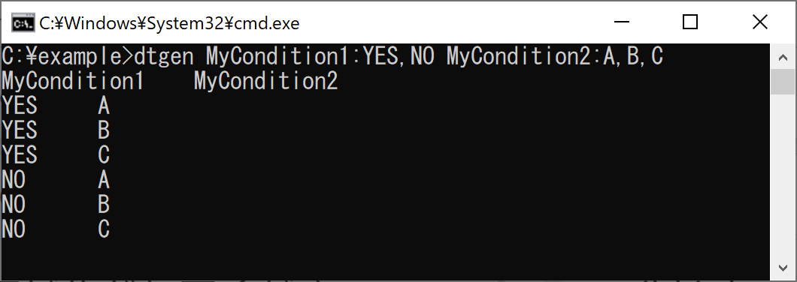
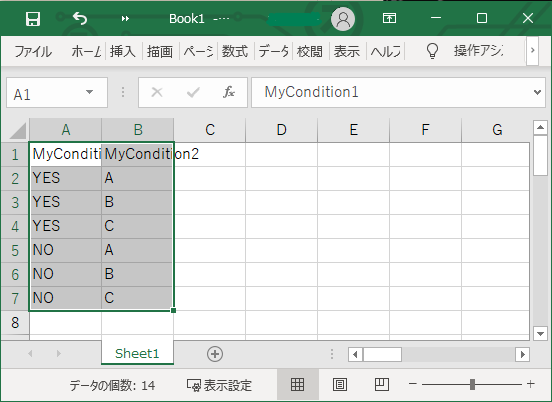

# dtgen (Decision Table Generator)
Generate decision table with CLI.  
CLIでデシジョンテーブル（決定表）を生成します。


## Usage 使い方

[Download](https://github.com/halllky/dtgen/releases/tag/main)

- You can download the binary from the link above or build it yourself.   
  上記リンクからバイナリをダウンロードするか、自身でビルドしてください。
- Enter the test conditions and the possible values for each condition, such as `condition1:value1,value2`  
  テストの条件およびそれぞれの条件がとりうる値を `条件1:値1,値2` のように入力してください。

Input
```
dtgen MyCondition1:YES,NO MyCondition2:A,B,C
```

Input (with `doenet` command)
```
dotnet dtgen.dll MyCondition1:YES,NO MyCondition2:A,B,C
```

Output  



### Working with Excel エクセルとの連携
Copy the output of dtgen to the clipboard and paste it into Excel.  
dtgenの出力をクリップボードにコピーしてExcelに貼り付けてください。

Input
```
dtgen MyCondition1:YES,NO MyCondition2:A,B,C | clip
```

※ `clip` はWindowsの標準コマンドです。



### Options 主なオプション
See the `--help` command for all options.  
全オプションについては `--help` コマンドを参照してください。

#### `-c` , `--constraint`
Limit the combinations to be output. You can specify more than one.  
出力する組み合わせに制約をかけます。複数指定可能です。

Input
```
dtgen ^
  os:win,mac,linux ^
  bit:x86,x64,* ^
  --constraint "IF os == win THEN bit IN x86,x64" ^
  --constraint "IF os != win THEN bit = *"
```

Output

|  os   |  bit  |
| :---: | :---: |
|  win  |  x86  |
|  win  |  x64  |
|  mac  |   *   |
| linux |   *   |

> In the above output result, the rows marked with ★ in the table below are omitted and only the remaining 4 rows are displayed.  
> 上記の出力結果では、以下の表の★印の行が制約に引っかかったため出力されず、残りの4行のみ出力されています。
>
>  |    os     |   bit   |      |
>  | :-------: | :-----: | :--- |
>  |    win    |   x86   |      |
>  |    win    |   x64   |      |
>  |  ~~win~~  |  ~~*~~  | ★    |
>  |  ~~mac~~  | ~~x86~~ | ★    |
>  |  ~~mac~~  | ~~x64~~ | ★    |
>  |    mac    |    *    |      |
>  | ~~linux~~ | ~~x86~~ | ★    |
>  | ~~linux~~ | ~~x64~~ | ★    |
>  |   linux   |    *    |      |

Operators
使用可能な演算子は以下です。
- in the `IF` clause (IF節で使用可能なもの)
  - `==` , `!=` , `IN` , `!IN`
- in the `THEN` clause (THEN節で使用可能なもの)
  - `=` , `!=` , `IN` , `!IN`

#### `-s` , `--separator`
Specifies the delimiter character. The default value is `Tab`.  
区切り文字を指定します。規定値はタブ区切りです。

#### `-H` , `--horizontal`
Outputs a table with its rows and columns reversed.  
表の縦横を逆転して出力します。

Input
```
dtgen MyCondition1:YES,NO MyCondition2:A,B,C --horizontal
```

Output

|                  |       |       |       |       |       |       |
| :--------------: | :---: | :---: | :---: | :---: | :---: | :---: |
| **MyCondition1** |  YES  |  YES  |  YES  |  NO   |  NO   |  NO   |
| **MyCondition2** |   A   |   B   |   C   |   A   |   B   |   C   |

## Development 開発者用情報
- .NET Core 3.1
- Visual Studio 2019 (Version 16.9.5)
- Publishing should be done from Visual Studio. (「発行」機能より)
